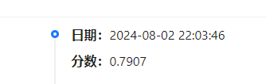

# Task4 prompt工程 提分思路
第二届世界科学智能大赛逻辑推理赛道：复杂推理能力评估

## 1 prompt 工程

在task3中的prompt的构建是基于：
### **CO-STAR 提示词框架**
由新加坡政府科技局（GovTech）组织的首届 GPT-4 提示工程大赛中一举夺冠的 Sheila Teo，介绍了他所使用的提示词框架 CO-STAR：

**Context-上下文** ： 为任务提供背景信息 。通过为大语言模型（LLM）提供详细的背景信息，可以帮助它精确理解讨论的具体场景，确保提供的反馈具有相关性。
**Objective-目标** ： 明确你要求大语言模型完成的任务 。清晰地界定任务目标，可以使大语言模型更专注地调整其回应，以实现这一具体目标。
**Style-风格** ： 明确你期望的写作风格 。你可以指定一个特定的著名人物或某个行业专家的写作风格，如商业分析师或 CEO。这将指导大语言模型以一种符合你需求的方式和词汇选择进行回应。
**Tone-语气** ： 设置回应的情感调 。设定适当的语气，确保大语言模型的回应能够与预期的情感或情绪背景相协调。可能的语气包括正式、幽默、富有同情心等。
**Audience-受众** ： 识别目标受众 。针对特定受众定制大语言模型的回应，无论是领域内的专家、初学者还是儿童，都能确保内容在特定上下文中适当且容易理解。
**Response-响应** ： 规定输出的格式 。确定输出格式是为了确保大语言模型按照你的具体需求进行输出，便于执行下游任务。常见的格式包括列表、JSON 格式的数据、专业报告等。对于大部分需要程序化处理大语言模型输出的应用来说，JSON 格式是理想的选择。
示例如下：
```prompt = f"""### Context:
你是一位逻辑推理专家，擅长解决各种逻辑推理问题。

### Observation:
以下是一个逻辑推理的题目，形式为单项选择题。所有的问题都基于闭世界假设，即未观测事实都为假。

### Skills:
你需要运用你的逻辑推理能力，仔细分析并得出正确答案。

### Task:
请逐步分析问题并得出结论。

### Action:
根据你的分析，只返回最终的答案。确保回复的格式是 "A" "B" "C" "D" 四个选项中的一个。不要提供任何解释或多余信息。如果无法推理出结果或问题模糊不清，请直接返回 "A"。

### Result:
最终答案应该只包括一个字母选项，确保回答简洁明了。

### 题目:
题目如下：有一个列表，找出该列表的最后一个元素。

### 问题:
{question}
```
## 2 agent优化
**agent是什么？**
我们把Agent想象成环境中的数字人，其中
Agent = 大语言模型（LLM） + 观察 + 思考 + 行动 + 记忆
这个公式概括了智能体的功能本质。为了理解每个组成部分，让我们将其与人类进行类比：
1. 大语言模型（LLM）：LLM作为智能体的“大脑”部分，使其能够处理信息，从交互中学习，做出决策并执行行动。
2. 观察：这是智能体的感知机制，使其能够感知其环境。智能体可能会接收来自另一个智能体的文本消息、来自监视摄像头的视觉数据或来自客户服务录音的音频等一系列信号。这些观察构成了所有后续行动的基础。
3. 思考：思考过程涉及分析观察结果和记忆内容并考虑可能的行动。这是智能体内部的决策过程，其可能由LLM进行驱动。
4. 行动：这些是智能体对其思考和观察的显式响应。行动可以是利用 LLM 生成代码，或是手动预定义的操作，如阅读本地文件。此外，智能体还可以执行使用工具的操作，包括在互联网上搜索天气，使用计算器进行数学计算等。
5. 记忆：智能体的记忆存储过去的经验。这对学习至关重要，因为它允许智能体参考先前的结果并据此调整未来的行动。

## 3 如何让agent速度更快
你需要使用更强大的大模型做好训练数据，以train的数据集作为输入样例（切记不要用test数据，因为test训练后作为微调数据送入是犯规行为，会被立即取消成绩！）
得到第一个agent结果后封装送入第二个agent在生成，最后将两套数据准备好。按照baseline2的流程进行训练。最后在设备上先后调用两个agent的到结果。如果不进行训练，可能最后提交任务无法在3小时内完成，复赛提交便会失败。

## 4 数据集的扩充

在网络上找寻推理类的数据集，进行扩充

如：[LogiQA](https://github.com/lgw863/LogiQA-dataset)

```
c
有些广东人不爱吃辣椒.因此,有些南方人不爱吃辣椒.
以下哪项能保证上述论证的成立？
A.有些广东人爱吃辣椒
B.爱吃辣椒的有些是南方人
C.所有的广东人都是南方人
D.有些广东人不爱吃辣椒也不爱吃甜食

a
室内荧光灯的连续照射对患心脏病的仓鼠的健康有益.一群暴露在荧光灯连续照射下的仓鼠平均寿命比另一群同种但生活在黑墙中的仓鼠长2.5%.
下列哪一项问题是进行上述实验的最初动因？
A.医院的光照疗法能被证明对病人的恢复有促进作用吗？
B.生活在灯光下的仓鼠与生活在黑暗中的仓鼠哪一种更长寿？
C.仓鼠患的是什么病？
D.是否有些仓鼠需要一段时间的阴暗？

b
毫无疑问,未成年人吸烟应该加以禁止.但是,我们不能为了防止给未成年人吸烟以可乘之机,就明令禁止自动售烟机的使用.这种禁令就如同为了禁止无证驾车在道路上设立路障,这道路障自然禁止了无证驾车,但同时也阻挡了99%以上的有证驾驶者.
为了对上述论证作了评价,回答以下哪个问题最为重要？
A.未成年吸烟者在整个吸烟者中所占的比例是否超过1%
B.禁止使用自动售烟机带给成年购烟者的不便究竟有多大？
C.无证驾车者在整个驾车者中所占的比例是否真的不超过1%
D.未成年人吸烟的危害,是否真如公众认为的那样严重？
```

进行脚本处理，得到：

```
    {
        "instruction": "今年联赛决赛的最后4支队伍是甲,乙,丙和丁.其中N与T分别为甲队和丁队的主教练.有人指出,甲队此前每次夺该项桂冠的赛季都曾战胜过T教练所在的球队;过去4年间,丁队在N教练的指导下,每隔一年都能夺得该项桂冠,而去年丁队没有夺冠.",
        "input": "以下哪项如果为真,与上述表述相矛盾?\nA.T教练可能执教过丁队\nB.N教练去年曾执教丁队\nC.甲队曾4次夺得该项冠军\nD.丁队前年未获得该项冠军",
        "output": "D"
    },
    {
        "instruction": "企业家舆论形象会对所代表的企业产生直接的影响,而在企业舆论事件中,企业家的言论与举措会受到媒体和网友最为集中的关注.企业舆情应对中,积极的态度是缓解负面舆论的最大助力.企业家在舆情应对上总体表现良好,但是也有企业家应对不当,导致负面舆情扩大,有损个人和企业声誉.",
        "input": "这句话的重点阐述对象是\nA.企业家舆论形象\nB.企业舆情事件\nC.企业舆情应对\nD.企业家舆情应对",
        "output": "D"
    },
```

与原始数据打乱融合，进行微调。


得分截图


